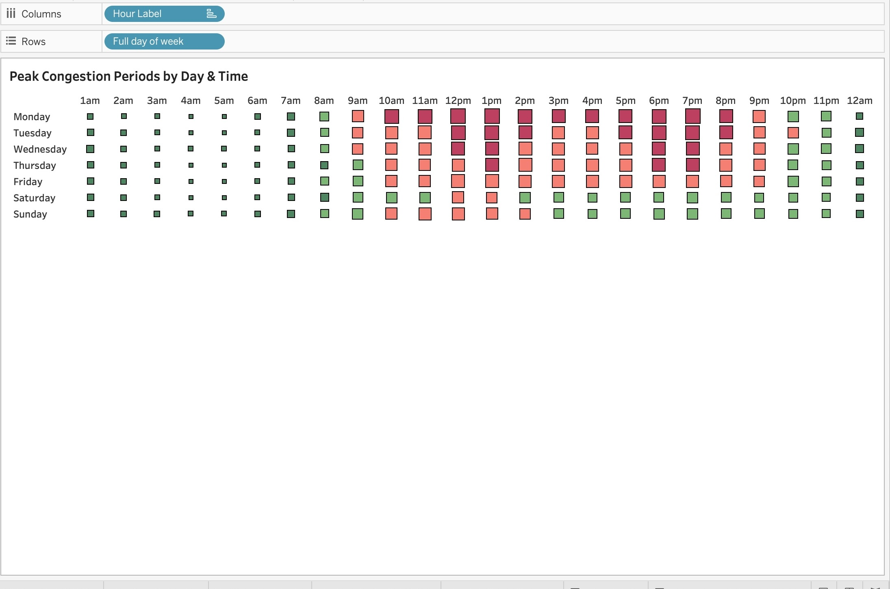
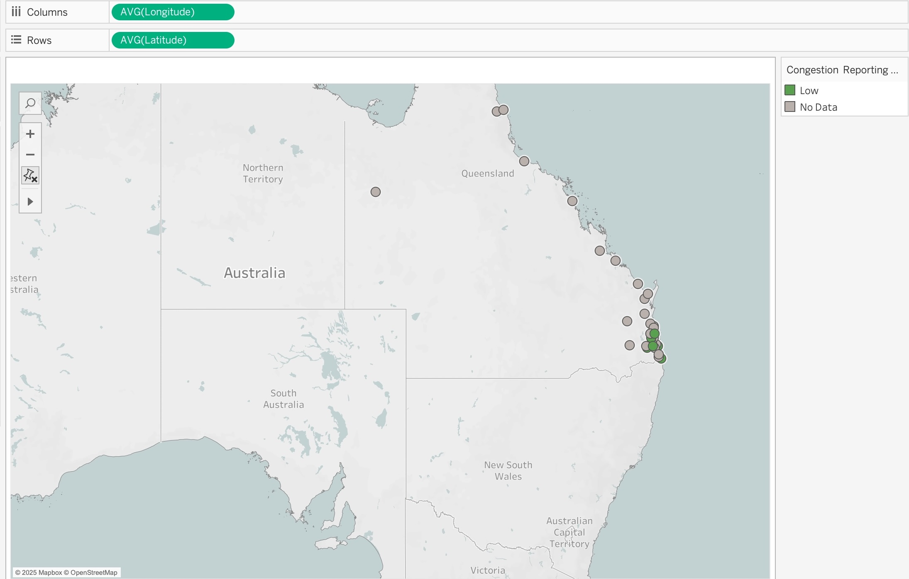

# Queensland-Hospital-Analysis

🏥 **Queensland Emergency Care Visibility — Exploratory Data Insights**
**Improving decision visibility for faster emergency care in Queensland**

📌 **Project Overview — Why This Matters**

Emergency departments (EDs) are under continuous pressure. Patient demand fluctuates unpredictably, wait times increase during surges, and leaders often have limited visibility into real-time performance. As a result; 

- People needing urgent care wait longer

- Hospital teams become strained without warning

- Resourcing decisions rely on incomplete information

🎯 **Objective**:

This **exploratory data analysis** reveals where and when pressures occur — and highlights **data blind-spots** restricting fair and informed health decision-making.

📌 Dashboard visualisation example below illustrates consistent peak congestion during late-day hours:

A lack of timely and complete data means risks to patient experience can remain invisible until too late.

📈 **KPI Summary — Emergency Care Performance Visibility**

| KPI                                                    |                   Result | Interpretation                                                       |
| ------------------------------------------------------ | -----------------------: | -------------------------------------------------------------------- |
| Total hospitals in dataset                             |                   **36** | Full geographic coverage across Queensland                           |
| Hospitals reporting *any* wait-time data               |      **31 / 36** *(86%)* | Sufficient baseline visibility for demand patterns                   |
| Hospitals reporting **both** wait-time + capacity data |     **5–8 / 36** *(20%)* | Major reporting maturity gap — high risk of blind spots              |
| Median wait time across reporting hospitals            |           **18 minutes** | Strong performance where data is available                           |
| Number of reporting categories with null values        |                 **High** | Data completeness impacts comparability and prioritisation decisions |
| Highest demand period                                  | **Weekdays 17:00–21:00** | After-hours surge drives operational strain                          |

“This dashboard reveals variations in demand and reporting coverage across Queensland hospitals.”

✨ **Key Risk:**
Good performance **cannot be verified** for hospitals lacking complete reporting.

🔍 **Business Questions**

Base on the above, this project is designed to drive actionable insights:

- Which hospitals experience the highest emergency demand — and when?
-  How do wait times vary across the state?
-  Does higher treatment capacity improve service responsiveness?
- Where are reporting gaps harming visibility?
- What operational levers could improve patient flow and experience?

These questions shift the work from dashboard creation to **evidence-based decision support**.

📀 **Data Sources**

| Dataset           | Purpose                              |
| ----------------- | ------------------------------------ |
| ED Busyness       | Understand demand cycles by day/time |
| Current Metrics   | Evaluate wait-time responsiveness    |
| Facility Metadata | Context: size, geography, capacity   |

📎 Public data from Queensland Government Open Data Portal
(Links included in repository)

🧠**Tech Stack**

| Component                 | Tools                                                 |
| ------------------------- | ----------------------------------------------------- |
| Data Querying + Modelling | SQL (BigQuery) — joins, SAFE_CAST, cleaning           |
| Visualisation             | Tableau Desktop + Tableau Public                      |
| Insight Development       | Behaviour-driven interpretation & narrative synthesis |

🔧**Methodology — Exploratory Data Analysis (EDA)**

1. Data ingestion into Bigquery staging
2. Cleansing + Type Standardisation
3. LEFT JOIN model → retain all 36 hospitals
4. Derived views for:

    - Peak demand patterns

    - Wait-time performance

    - Capacity + risk indicators

5.  Tableau development with:

    - Statewide performance map

    - Heatmap of hourly ED strain

    - capacity vs responsiveness of hospitals

    - KPI summary → data quality + reporting maturity

    📉 **Data Quality = Leadership Risk** 

This dataset reveals a  **system level risk**:

| Area                   | Current State                   | Impact                                   |
| ---------------------- | ------------------------------- | ---------------------------------------- |
| Reporting completeness | Strong baseline demand coverage | Able to track surge patterns             |
| Capacity reporting     | Extremely limited               | Leaders lack visibility into bottlenecks |
| Timeliness             | Highly inconsistent             | Delayed recognition of patient risk      |
| Hospital equity        | Regional gaps                   | Fair access cannot be assessed           |

📌 **Data maturity is uneven**, creating inequity in performance visibility across the state.

📊 **Key Insights**

**Demand Peaks Most Evenings (17:00–21:00)**

Demand peaks **17:00–21:00**, exactly when staffing typically decreases.

**More Capacity ≠ Faster Care**

Operational efficiency matters more than facility size

➡ Only **~20%** of hospitals provide full performance metrics → comparisons limited.

**Reporting Gap Hides Performance Risks**

Regional hospitals show the highest uncertainty → potentially the highest service risk.

🧩 **Recommendations — For Health Leadership**

| Theme          | Action                                | Expected Benefit               |
| -------------- | ------------------------------------- | ------------------------------ |
| Visibility     | Standardise wait + capacity reporting | Fair statewide comparisons     |
| Responsiveness | Align staffing with peak times        | Less crowding + faster triage  |
| Accountability | Public wait-time dashboards           | Increased community trust      |
| Risk Readiness | Alerts for emerging bottlenecks       | Faster escalation + safer care |

These improvements are low-cost and high-impact.

🚀 **Future Enhancements — Mixed-Method Strength**

As a data analyst with **advanced qualitative expertise**, I will expand this project by:

- Interviewing ED staff to understand **workflow + behavioural drivers** behind delays
- Incorporating patient outcome data to measure **care quality**, not just efficiency
- Building **forecasting models** for surge demand
- Automating data pipelines + near-real-time alerting
- Developing **data governance** tracking reporting compliance + latency

This approach enables **continuous improvement of patient experience** — not just reporting.

🗂 **Access the Dashboard**

🔗 (https://public.tableau.com/app/profile/presca.evans/viz/QueenslandHospitalAnalysis/QueenslandHospitalAnalysis)

**Repository Structure**

/sql              → BigQuery cleaning & modelling scripts  
/dashboard        → Tableau workbook (.twbx)  
README.md         → Project documentation  

